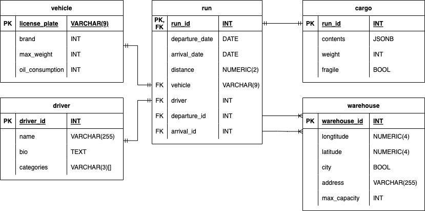

# Generate 100 million records of interconnected data

As a part of a lab work in "Database Management Systems Course" at BMSTU we had a task to popullate a database with a 100 million records of data in order to subsequently learn how to optimize DB and queries. This repo contains Jupyter Notebook for generating data for a given DB schema.

## How it works?

The program relies on Python library *[faker](https://faker.readthedocs.io/en/master/)*. *Faker* is capable of generating a variety of data, from basic numbers to existing addresses and json files. The obvious flaw of using *Faker* is it's execution speed, which is rather slow.

The whole program is basically a single class with functions defined for every table in a database. *generate_csv* may check the input, create a directory for output files if it wasn't done before, and run functions for generating every single table.

During the process of development of a program it became obvious that it will be faster to pre-generate some data using *Faker* and saving it in a separate file, where possible.

If you feel more comfortable with Google Colab, you may find the source code [here](https://colab.research.google.com/drive/1oiKxNVyOgZXIHo_GgB8qKv3Q-5IPPyI5#scrollTo=18c68bf2).

## The database

*Schema of database*

Given DB describes logistics innformation for a random company in the US, including locations of warehouses, information about trucks, drivers and every single cargo shipment.

The database consists of 5 tables and has a star-like shape with 4 tables being connected to the main one (run).

## Further learning

The execution of the program for 100m records for 2 two tables (as stated in the task) takes more than 40 minutes. Obviusly there is a plenty room for optimization. 

Some data may also seem unrealistic. For instance, calculating distance using geopy would increase execution time for _run_ table by almost 40%. That is why I decided to generate a random distance, that doesn't involve actual coordinates. Apparently there is a way to optimize the formula (maybe using not exact, but approximate value) without dramatic execution time increase.
